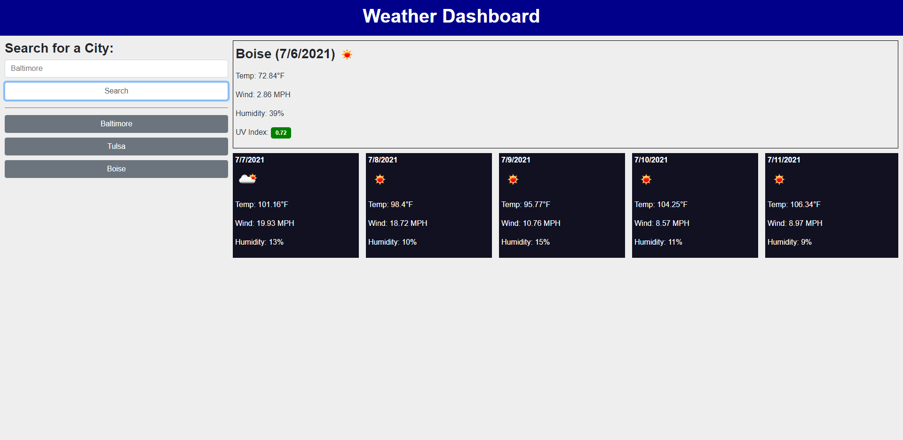
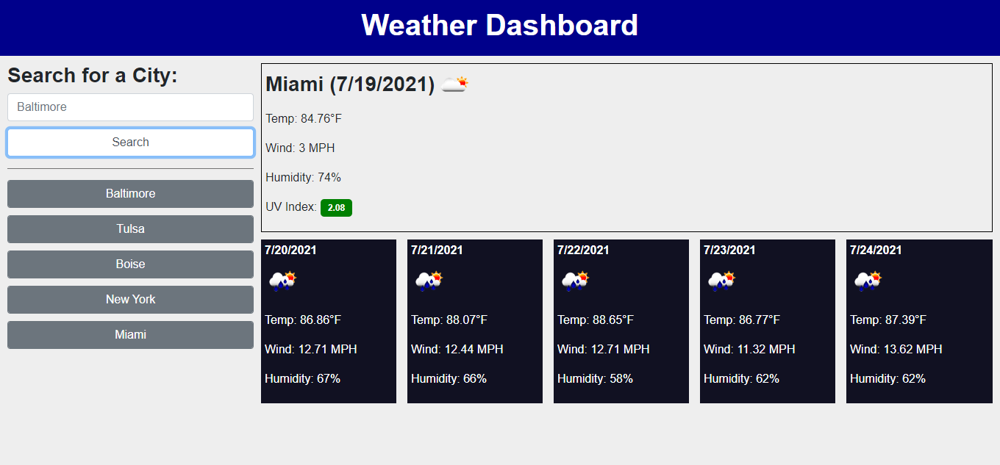

# Weather Dashboard

## Description
This project is a weather dashboard that was built using HTML, CSS, Bootstrap, JavaScript, jQuery, Moment.js, and the Open Weather API.

When you enter a city, it gives the current weather conditions, and a 5-day forecast. The city is then added to the search history and saved to `localStorage` so that refreshing the page will not remove the search history.

Clicking on cities in the search history will return you to the weather for that city.

## Page Link
The project can be viewed at <https://tharveyster.github.io/weather-dashboard/>.

## Screenshots

## License
Copyright 2021 Todd Harvey

Permission is hereby granted, free of charge, to any person obtaining a copy of this software and associated documentation files (the "Software"), to deal in the Software without restriction, including without limitation the rights to use, copy, modify, merge, publish, distribute, sublicense, and/or sell copies of the Software, and to permit persons to whom the Software is furnished to do so, subject to the following conditions:

The above copyright notice and this permission notice shall be included in all copies or substantial portions of the Software.

THE SOFTWARE IS PROVIDED "AS IS", WITHOUT WARRANTY OF ANY KIND, EXPRESS OR IMPLIED, INCLUDING BUT NOT LIMITED TO THE WARRANTIES OF MERCHANTABILITY, FITNESS FOR A PARTICULAR PURPOSE AND NONINFRINGEMENT. IN NO EVENT SHALL THE AUTHORS OR COPYRIGHT HOLDERS BE LIABLE FOR ANY CLAIM, DAMAGES OR OTHER LIABILITY, WHETHER IN AN ACTION OF CONTRACT, TORT OR OTHERWISE, ARISING FROM, OUT OF OR IN CONNECTION WITH THE SOFTWARE OR THE USE OR OTHER DEALINGS IN THE SOFTWARE.

## Contact Info
Email: todd@theharveysplace.com
